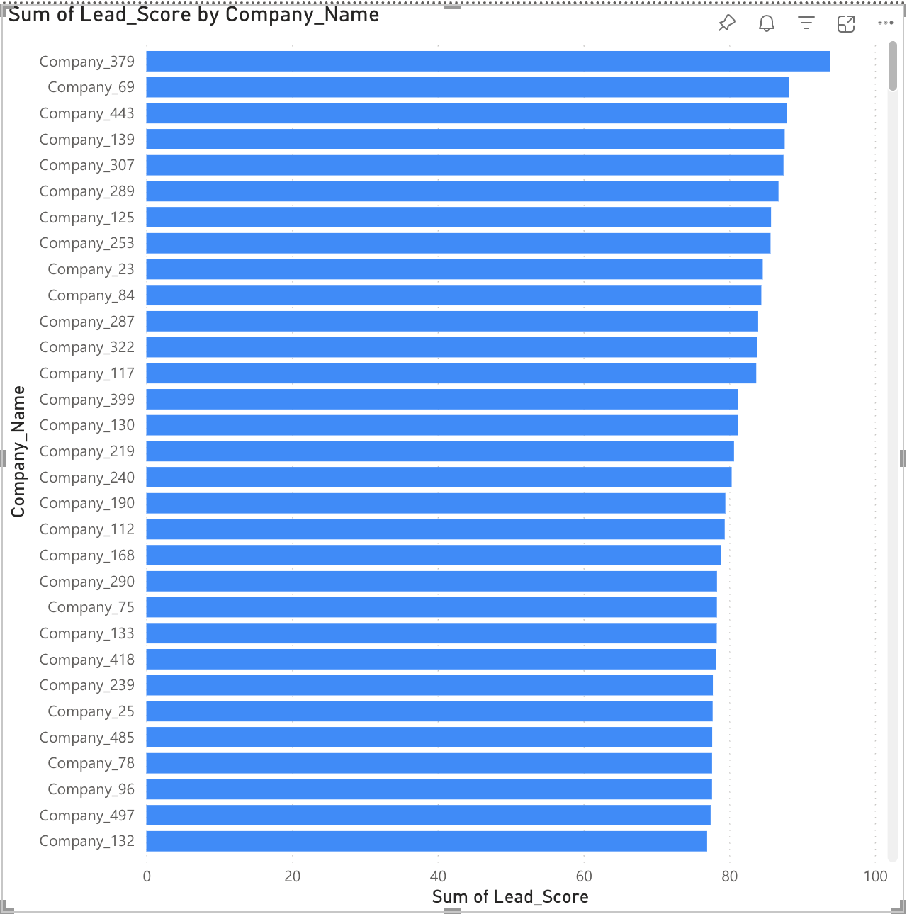
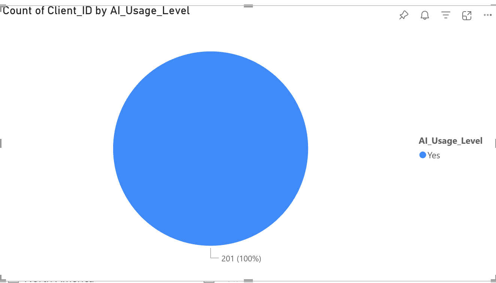
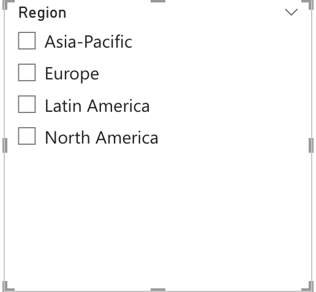

# 🧠 Client Insights Dashboard

A data-driven lead prioritization project to help businesses identify high-potential clients based on their AI adoption, engagement level, and growth potential.

I created this dashboard to simulate how pre-sales and analyst teams can use data insights to make faster, smarter outreach decisions.

## 🔍 Project Overview

This project walks through the end-to-end process of:
- Generating a synthetic enterprise client dataset
- Designing a lead scoring model using weighted factors
- Visualizing ranked leads using Power BI
- Applying real-time filters (region, industry, AI usage, PoC status)

## 📊 Dashboard Features

- Top 10 Client Leads ranked by AI-readiness and engagement
- Pie chart breakdown of AI usage levels
- Interactive slicers for Region, Industry, and PoC completion
- Built-in KPIs for sales enablement

## 🧮 Lead Scoring Logic

Each lead is scored out of 100 based on:
| Feature              | Weight (%) |
|----------------------|------------|
| AI Readiness         | 30%        |
| Growth Rate          | 25%        |
| CRM & Email Activity | 25%        |
| PoC Completed        | 20%        |

> The scoring model is implemented in [`lead_scoring_logic.py`](lead_scoring_logic.py)

## 📁 Project Structure
ClientInsightsDashboard/
├── data/ # Raw client dataset (CSV)
├── reports/ # README and Python logic
├── visuals/ # Screenshots of the Power BI dashboard
├── lead_scoring_logic.py
└── README.md

## 🛠 Tools & Technologies

- Python(data generation and scoring)
- Power BI (data visualization)
- Pandas**, random, Power BI slicers & filters
- Markdown for documentation

## 📸 Visual Samples

### 🔝 Top Clients by Score

### 🧠 AI Adoption Levels

### 🧭 Filters in Action

---

## 🚀 Why I Built This

I wanted to sharpen my skills in:
- Turning raw data into business decisions
- Creating dashboards that tell a clear story
- Practicing the type of analysis used in technical sales, consulting, and BI roles

