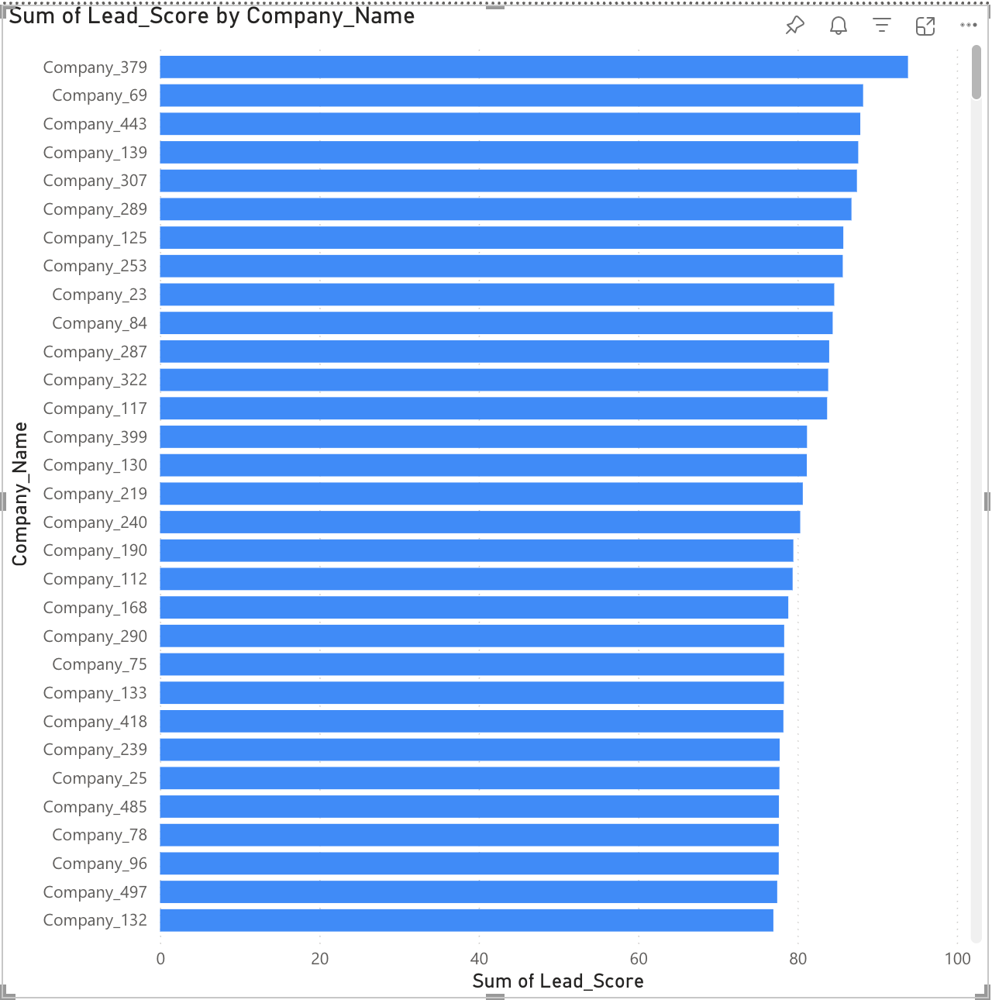

# Client Lead Prioritization Dashboard

## Overview

This project focuses on identifying and ranking potential enterprise clients based on their AI readiness, growth potential, and engagement level. The goal is to help sales and strategy teams prioritize leads more effectively by providing clear, data-backed insights through an interactive dashboard.

## What I Did

- Created a synthetic dataset of 500 enterprise clients with attributes like region, industry, AI adoption level, growth rate, and CRM engagement.
- Built a scoring model in Python to rank clients based on weighted factors such as AI usage, growth rate, PoC completion, and email/CRM scores.
- Designed a Power BI dashboard that visualizes the top-ranked leads, AI adoption distribution, and allows filtering by industry, region, and PoC status.

## Technologies Used

- Python (for data creation and scoring)
- Power BI (for building and sharing the dashboard)
- Excel/CSV (data import/export)
- Data modeling and basic statistics

## Dashboard Preview

I provided snapshot of the final dashboard that includes lead scores, slicers for filtering, and insights on AI adoption:

## Folder Structure
# Client Lead Prioritization Dashboard

## Overview

This project focuses on identifying and ranking potential enterprise clients based on their AI readiness, growth potential, and engagement level. The goal is to help sales and strategy teams prioritize leads more effectively by providing clear, data-backed insights through an interactive dashboard.

## What I Did

- Created a synthetic dataset of 500 enterprise clients with attributes like region, industry, AI adoption level, growth rate, and CRM engagement.
- Built a scoring model in Python to rank clients based on weighted factors such as AI usage, growth rate, PoC completion, and email/CRM scores.
- Designed a Power BI dashboard that visualizes the top-ranked leads, AI adoption distribution, and allows filtering by industry, region, and PoC status.

## Technologies Used

- Python (for data creation and scoring)
- Power BI (for building and sharing the dashboard)
- Excel/CSV (data import/export)
- Data modeling and basic statistics

## Dashboard Preview

Here’s a snapshot of the final dashboard that includes lead scores, slicers for filtering, and insights on AI adoption:

### 📊 Top 10 Leads by Score

### 🧠 AI Adoption Across Clients

### 🎛️ Filters in Action

